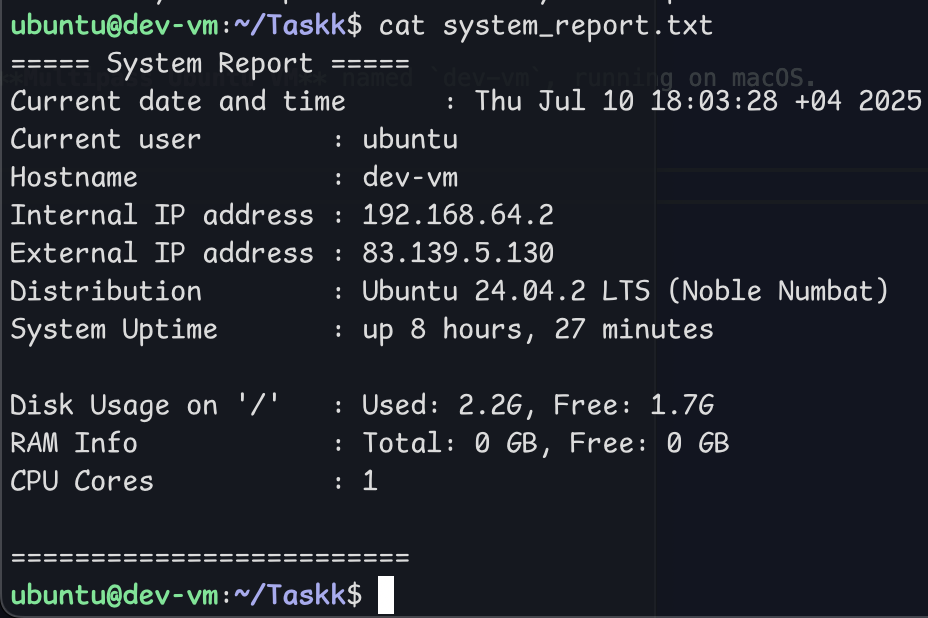
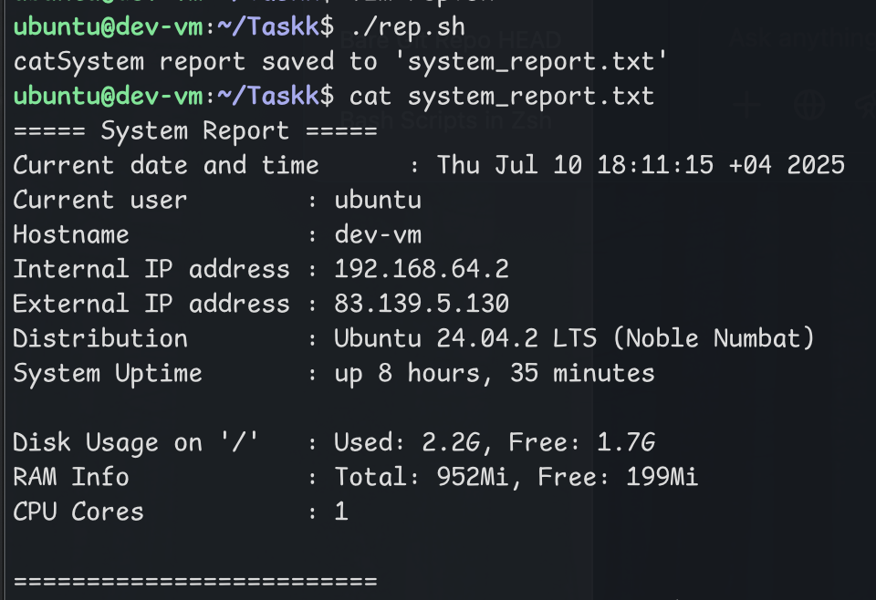

# System Report Script

This Bash script collects basic system information and writes it to a file called `system_report.txt`.

## What it shows:
- Current date and time
- Current logged-in user
- Hostname
- Internal IP address
- External IP address (via `curl` to ifconfig.me)
- OS distribution name and version
- System uptime
- Disk usage on `/`
- RAM usage  
- CPU core count
- CPU frequency (MHz)

##  Environment

This script was developed and tested inside a **Multipass Ubuntu VM** named `dev-vm`, running on macOS.  
##  Requirements

This script uses the following standard tools:
- `date`
- `whoami`
- `hostname`
- `awk`
- `df`
- `free`
- `uptime`
- `lscpu`
- `nproc`
- `curl` (for external IP)

##  Example Output

---

Let me know if you want to automate this script with `cron`, or add more info like disk partitions or running services.